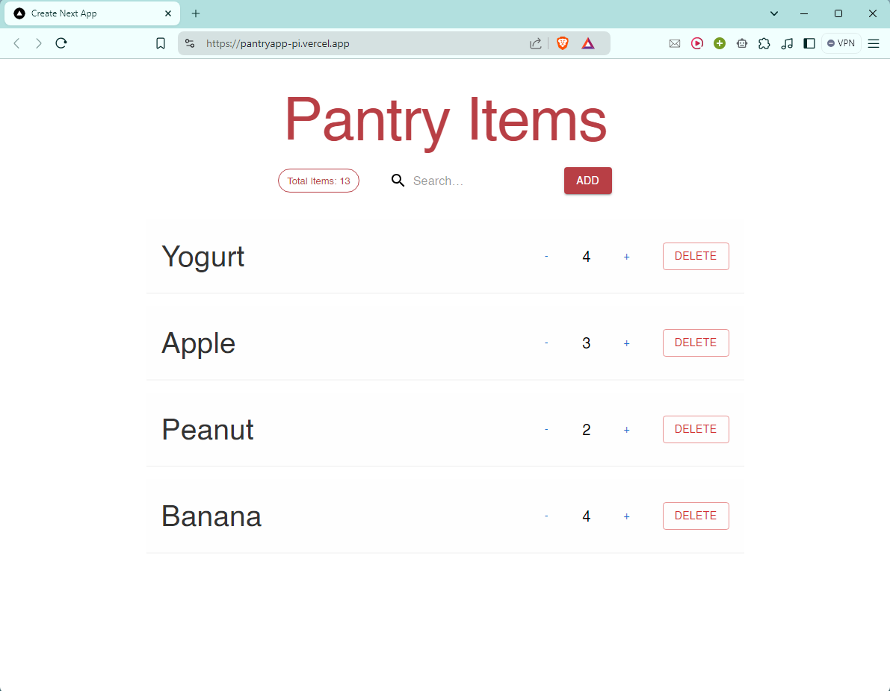

# Pantry App Tracker



This is a Pantry App Tracker built using [Next.js](https://nextjs.org/) and [React](https://reactjs.org/), connected with [Firebase](https://firebase.google.com/), and deployed on [Vercel](https://vercel.com/). The project is part of Headstarter AI Fellowship

## Getting Started

To run the development server, use:

```bash
npm run dev
# or
yarn dev
# or
pnpm dev
# or
bun dev
```

Open http://localhost:3000 in your browser to view the app.

You can start editing the page by modifying app/page.tsx. The page auto-updates as you edit the file.

This project uses next/font to automatically optimize and load Inter, a custom Google Font.

## Deployment

The app is deployed on Vercel and can be accessed at https://pantryapp-pi.vercel.app/.

## To Do

<ul>
        <li>
            <input type="checkbox" id="task1" checked>
            <label for="task1">Set up a Next.js project with Material UI components</label>
        </li>
        <li>
            <input type="checkbox" id="task2" checked>
            <label for="task2">Implement a Firebase backend for data storage</label>
        </li>
        <li>
            <input type="checkbox" id="task3" checked>
            <label for="task3">Create a form to add, delete, and update pantry items</label>
        </li>
        <li>
            <input type="checkbox" id="task4" checked>
            <label for="task4">Add a search or filter functionality to easily find items</label>
        </li>
        <li>
            <input type="checkbox" id="task5" checked>
            <label for="task5">Create a presentable frontend design to display all pantry items</label>
        </li>
        <li>
            <input type="checkbox" id="task6" checked>
            <label for="task6">Deploy to Vercel and use CI/CD</label>
        </li>
        <li>
            <input type="checkbox" id="bonus1" checked>
            <label for="bonus1">Take images with mobile or browser camera and upload to Firebase</label>
        </li>
        <li>
            <input type="checkbox" id="bonus2">
            <label for="bonus2">Use GPT Vision API or other LLMs to classify images and then update to Firebase</label>
        </li>
        <li>
            <input type="checkbox" id="bonus3">
            <label for="bonus3">Use GCP Vertex AI and AutoML to classify 4-5 images of items near you and update Firebase</label>
        </li>
        <li>
            <input type="checkbox" id="bonus4">
            <label for="bonus4">Add a recipe suggestion feature based on pantry contents using the OpenAI API or OpenRouter API</label>
        </li>
    </ul>

## Feedback

Feel free to provide feedback or contribute to the project on GitHub.
